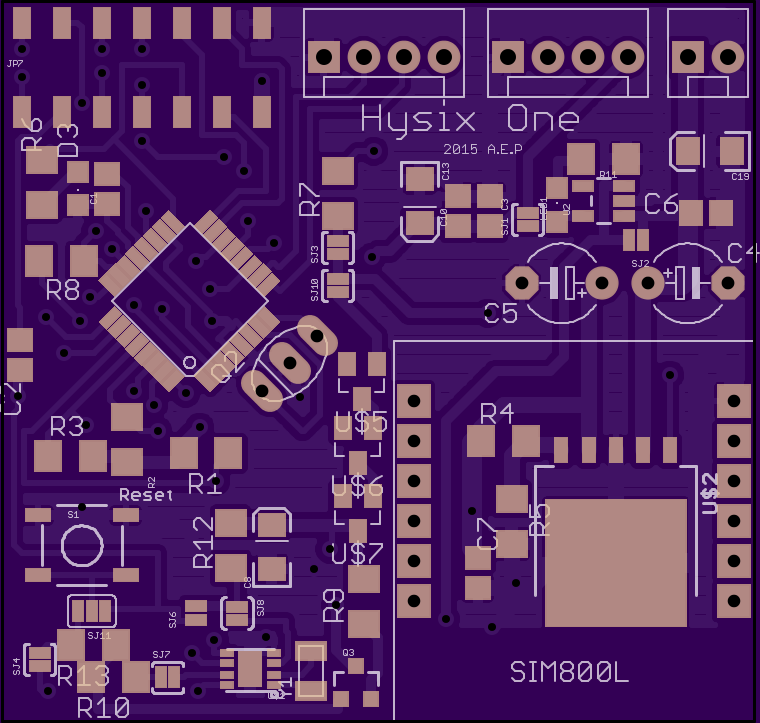

Hysix One
=================

An Arduino compatible long runtime GSM sensor board.
The board is designed for use cases where the MCU remains mostly idle, then switches on in regular intervals to collect data and talk to the internet.

Features
-----
- Two external sensors with each 2 data lines can be connected and powered from the board.
- GSM module can be powered off completely independant from system power
- Ultra low power RTC switches entire board power (except RTC itself) for very long idle runtime.
- Arduino IDE compatible.

Mappings
-----
<table>
    <tr>
        <td>SIM800L RX</td>
        <td>7</td>
        <td></td>
    </tr>
    <tr>
        <td>SIM800L TX</td>
        <td>8</td>
        <td></td>
    </tr>
    <tr>
        <td>SIM800L Enable Power</td>
        <td>9</td>
        <td>switch power to the SIM</td>
    </tr>
    <tr>
        <td>LDO_ENABLE</td>
        <td>10</td>
        <td>enable line for the LDO supplying the avr</td>
    </tr>
    <tr>
        <td>BATTER_METER</td>
        <td>A0</td>
        <td>raw battery voltage divided by two</td>
    </tr>
    <tr>
        <td>BATTER_METER_ENABLE</td>
        <td>2</td>
        <td>pull low to enable voltage divider</td>
    </tr>
    <tr>
        <td>SENSOR PINS</td>
        <td>3,4,5,6,</td>
        <td>data lines on the sensor connectors </td>
    </tr>
    <tr>
        <td>RTC</td>
        <td>I2C</td>
        <td>RTC is on standard I2C bus</td>
    </tr>
</table>

Stats
-----

<table>
    <tr>
        <td>Peak Power</td>
        <td>200mA</td>
    </tr>
    <tr>
        <td>Idle Power</td>
        <td>11mA</td>
    </tr>
    <tr>
        <td>RTC Standby Power</td>
        <td> &lt; 1uA </td>
    </tr>
</table>

RTC
-----

The RTC is a DS134X TDFN at I2C address 0x68 that switches the entire system off, keeps a clock, and switches it back on at a desired time.
In the default solder jumper configuration, it has INTB connected to LDO enable, inverted by a transistor,
so that high means LDO is on, which is the default in shipping state.
The avr remains powered until the RTC gets interupt enable set.

Visual
-------
size aprox 5x5cm

Design Notes
-------

- The Diodes in front of the RTC are supposed to drop voltage from BAT to max 5V. There is no extra regulator, because the RTC is fairly tolerant.
- There's no routing to the reset pin of the SIM800. To use the FONA library, it needs to have the reset code removed.
- The reset button turns the avr ON when the RTC switched the system off. Make sure to reset the RTC fairly early so that system stays on after releasing the button.

License
-------
http://opensource.org/licenses/MIT

Bugs
------

1. Forgot to route reset without the arduino cap.
   To burn a bootloader, reset needs to be soldered onto the MCU side of R2 instead of using the pin header.
   During normal arduino 'uploading', the pins will work fine.

2. The connector parts in the scheme don't actually fit. Ignore them and use bare pin headers.

3. LDO_ENABLE is a wasted pin. The RTC is already enabling the LDO. It's probably a good idea to leave SJ4 open.

4. Forgot resistors for RX on the SIM800. The SIM800 is speced at max 3.1V TTL. Works fine, but...

5. The package for the Crystal is wrong. It's an SMD package, but the layout is for through hole.
   It fits sort of anyway. Originally i intended to run the avr without crystal, but the factory tunings for
   the internal clock are for 3.3V, not for 5V. A nightmare not worth it.
